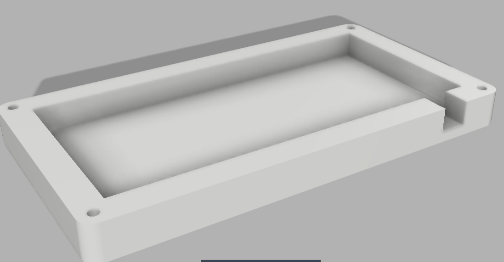
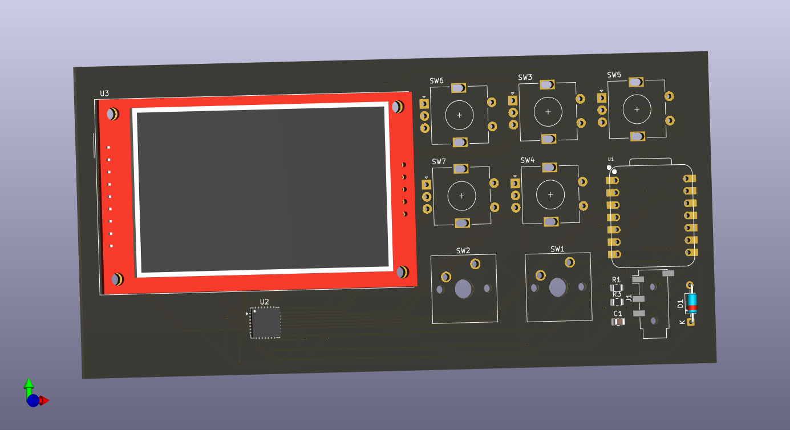
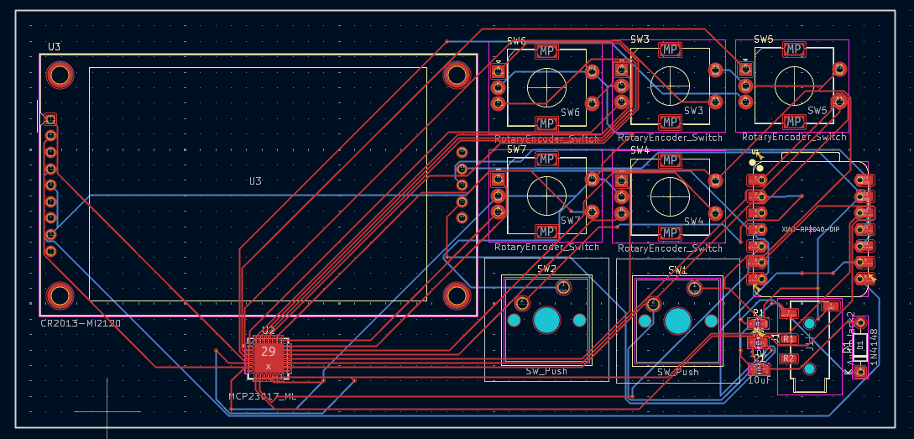
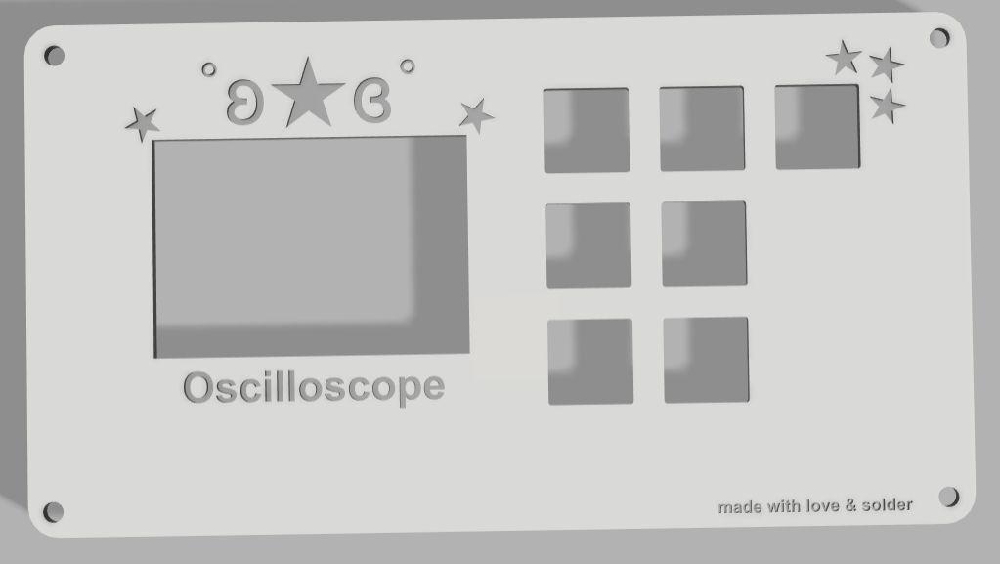

# Oscilloscope

A small portable oscilloscope, made with curiosity! I'm a **technical high school student in Electrotechnics**, and during one full semester we studied oscilloscopes: how they work, how signals are displayed, how to read time and voltage scales, trigger behavior, measurements, and practical use in electronics labs.  
At some point, a thought naturally came up: now that I understand how an oscilloscope works… why not build one myself
So I did hihi!
This project is a compact digital oscilloscope, including schematic, PCB, firmware, and even the case design.  
It features a color TFT display with a classic oscilloscope grid, adjustable vertical and horizontal scales, configurable trigger (rising or falling edge), and automatic measurements such as Vpp, Vrms, and signal frequency.  
The interface is controlled using rotary encoders, and the device boots with a custom splash screen, because instruments can be functional and cute. The overall aesthetic was intentionally designed to be soft and friendly, with pastel tones and a personal touch that makes it feel less like a lab instrument and more like something made by a person who genuinely enjoys electronics.

## Screenshots






## Project Structure
```
/
├── case/
│ ├── toposciloscopio.step
│ ├── toposciloscopio.stl
│ ├── osciloscopiocase.step
│ └── osciloscopiocase.stl
│
├── firmware/
│ ├── osciloscopio_firmware.ino
│ └── test.py
│
├── images/
│ ├── case.png
│ ├── oscilloscopio_3d.png
│ ├── oscilloscopio_pcb.png
│ ├── oscilloscopio_schematic.png
│ └── top.png
│
├── pcb/
│ ├── gerbers/
│ ├── osciloscopio.csv
│ ├── osciloscopio.kicad_pcb
│ ├── osciloscopio.kicad_pro
│ └── osciloscopio.kicad_sch
├── LICENSE
└── README.md
```
